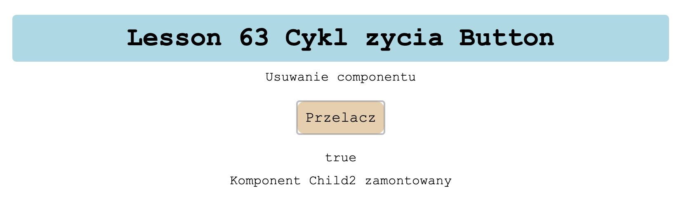

# Lesson 63
Cykl zycia komponentu na przykladzie przycisku

### componentDidMount() {
### console.log("Child2 zamontowana");
### }
### componentDidUpdate() {
### console.log("Child2 aktualizowana");
### }
### componentWillUnmount() {
### console.log("Child2 odmontowany");
### }

